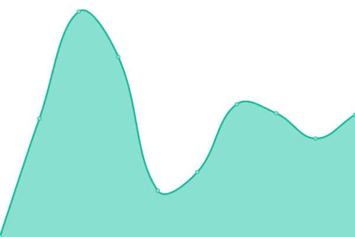
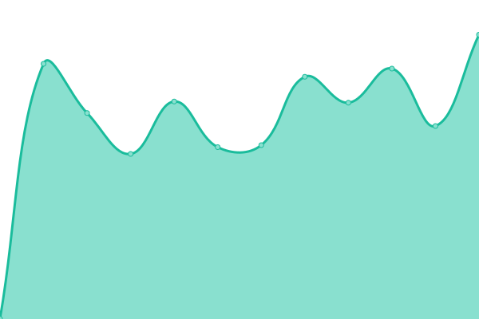
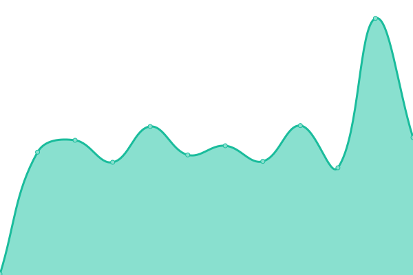

# [📈 Live Status](https://nicholasvdb.github.io/ichoosr-status): <!--live status--> **🟩 All systems operational**

This repository contains the open-source uptime monitor and status page for [nicholasvdb](https://nicholasvdb.github.io/ichoosr-status), powered by [Upptime](https://github.com/upptime/upptime).

With [Upptime](https://upptime.js.org), you can get your own unlimited and free uptime monitor and status page, powered entirely by a GitHub repository. We use [Issues](https://github.com/nicholasvdb/ichoosr-status/issues) as incident reports, [Actions](https://github.com/nicholasvdb/ichoosr-status/actions) as uptime monitors, and [Pages](https://nicholasvdb.github.io/ichoosr-status) for the status page.

<!--start: status pages-->
<!-- This summary is generated by Upptime (https://github.com/upptime/upptime) -->
<!-- Do not edit this manually, your changes will be overwritten -->
<!-- prettier-ignore -->
| URL | Status | History | Response Time | Uptime |
| --- | ------ | ------- | ------------- | ------ |
|  [Google](https://www.google.com) | 🟩 Up | [google.yml](https://github.com/nicholasvdb/ichoosr-status/commits/HEAD/history/google.yml) | 

 151ms
     
 | 

<a href="https://nicholasvdb.github.io/ichoosr-status/history/google">100.00%</a>
    

|  [ENNL API](https://api-ennl.ichoosr.com) | 🟩 Up | [ennl-api.yml](https://github.com/nicholasvdb/ichoosr-status/commits/HEAD/history/ennl-api.yml) | 

 1018ms
     
 | 

<a href="https://nicholasvdb.github.io/ichoosr-status/history/ennl-api">100.00%</a>
    

|  [SPNL API](https://api-spnl.ichoosr.com) | 🟩 Up | [spnl-api.yml](https://github.com/nicholasvdb/ichoosr-status/commits/HEAD/history/spnl-api.yml) | 

 979ms
     
 | 

<a href="https://nicholasvdb.github.io/ichoosr-status/history/spnl-api">100.00%</a>
    

|  [TPNL API](https://api-tpnl.ichoosr.com) | 🟩 Up | [tpnl-api.yml](https://github.com/nicholasvdb/ichoosr-status/commits/HEAD/history/tpnl-api.yml) | 

 949ms
     
 | 

<a href="https://nicholasvdb.github.io/ichoosr-status/history/tpnl-api">100.00%</a>
    

|  [ECNL API](https://api-ecnl.ichoosr.com) | 🟩 Up | [ecnl-api.yml](https://github.com/nicholasvdb/ichoosr-status/commits/HEAD/history/ecnl-api.yml) | 

 953ms
     
 | 

<a href="https://nicholasvdb.github.io/ichoosr-status/history/ecnl-api">100.00%</a>
    

|  [ENBE API](https://api-enbe.ichoosr.com) | 🟩 Up | [enbe-api.yml](https://github.com/nicholasvdb/ichoosr-status/commits/HEAD/history/enbe-api.yml) | 

 944ms
     
 | 

<a href="https://nicholasvdb.github.io/ichoosr-status/history/enbe-api">100.00%</a>
    

|  [SPBE API](https://api-spbe.ichoosr.com) | 🟩 Up | [spbe-api.yml](https://github.com/nicholasvdb/ichoosr-status/commits/HEAD/history/spbe-api.yml) | 

 932ms
     
 | 

<a href="https://nicholasvdb.github.io/ichoosr-status/history/spbe-api">100.00%</a>
    

|  [REBE API](https://api-rebe.ichoosr.com) | 🟩 Up | [rebe-api.yml](https://github.com/nicholasvdb/ichoosr-status/commits/HEAD/history/rebe-api.yml) | 

 949ms
     
 | 

<a href="https://nicholasvdb.github.io/ichoosr-status/history/rebe-api">100.00%</a>
    

|  [ENUK API](https://api-enuk.ichoosr.com) | 🟩 Up | [enuk-api.yml](https://github.com/nicholasvdb/ichoosr-status/commits/HEAD/history/enuk-api.yml) | 

 968ms
     
 | 

<a href="https://nicholasvdb.github.io/ichoosr-status/history/enuk-api">100.00%</a>
    

|  [SPUK API](https://api-spuk.ichoosr.com) | 🟩 Up | [spuk-api.yml](https://github.com/nicholasvdb/ichoosr-status/commits/HEAD/history/spuk-api.yml) | 

 902ms
     
 | 

<a href="https://nicholasvdb.github.io/ichoosr-status/history/spuk-api">100.00%</a>
    

|  [ENUS API](https://api-enus.ichoosr.com) | 🟩 Up | [enus-api.yml](https://github.com/nicholasvdb/ichoosr-status/commits/HEAD/history/enus-api.yml) | 

 339ms
     
 | 

<a href="https://nicholasvdb.github.io/ichoosr-status/history/enus-api">100.00%</a>
    

|  [ENJP API](https://api-enjp.ichoosr.com) | 🟩 Up | [enjp-api.yml](https://github.com/nicholasvdb/ichoosr-status/commits/HEAD/history/enjp-api.yml) | 

 1012ms
     
 | 

<a href="https://nicholasvdb.github.io/ichoosr-status/history/enjp-api">99.75%</a>
    

|  [SPJP API](https://api-spjp.ichoosr.com) | 🟩 Up | [spjp-api.yml](https://github.com/nicholasvdb/ichoosr-status/commits/HEAD/history/spjp-api.yml) | 

 1003ms
     
 | 

<a href="https://nicholasvdb.github.io/ichoosr-status/history/spjp-api">100.00%</a>
    

|  [ENNL APP](https://app-ennl.ichoosr.com) | 🟩 Up | [ennl-app.yml](https://github.com/nicholasvdb/ichoosr-status/commits/HEAD/history/ennl-app.yml) | 

 695ms
     
 | 

<a href="https://nicholasvdb.github.io/ichoosr-status/history/ennl-app">100.00%</a>
    

|  [SPNL APP](https://app-spnl.ichoosr.com) | 🟩 Up | [spnl-app.yml](https://github.com/nicholasvdb/ichoosr-status/commits/HEAD/history/spnl-app.yml) | 

 688ms
     
 | 

<a href="https://nicholasvdb.github.io/ichoosr-status/history/spnl-app">100.00%</a>
    

|  [TPNL APP](https://internetcollectief.eigenhuis.nl) | 🟩 Up | [tpnl-app.yml](https://github.com/nicholasvdb/ichoosr-status/commits/HEAD/history/tpnl-app.yml) | 

 655ms
     
 | 

<a href="https://nicholasvdb.github.io/ichoosr-status/history/tpnl-app">98.09%</a>
    

|  [ECNL APP](https://samen.nl) | 🟩 Up | [ecnl-app.yml](https://github.com/nicholasvdb/ichoosr-status/commits/HEAD/history/ecnl-app.yml) | 

 687ms
     
 | 

<a href="https://nicholasvdb.github.io/ichoosr-status/history/ecnl-app">100.00%</a>
    

|  [ENBE APP](https://ichoosr.be/energie/ichoosr/home) | 🟩 Up | [enbe-app.yml](https://github.com/nicholasvdb/ichoosr-status/commits/HEAD/history/enbe-app.yml) | 

 544ms
     
 | 

<a href="https://nicholasvdb.github.io/ichoosr-status/history/enbe-app">100.00%</a>
    

|  [SPBE APP](https://ichoosr.be/zonnepanelen/) | 🟩 Up | [spbe-app.yml](https://github.com/nicholasvdb/ichoosr-status/commits/HEAD/history/spbe-app.yml) | 

 152ms
     
 | 

<a href="https://nicholasvdb.github.io/ichoosr-status/history/spbe-app">100.00%</a>
    

|  [REBE APP](https://ichoosr.be/thuisbatterij/) | 🟩 Up | [rebe-app.yml](https://github.com/nicholasvdb/ichoosr-status/commits/HEAD/history/rebe-app.yml) | 

 155ms
     
 | 

<a href="https://nicholasvdb.github.io/ichoosr-status/history/rebe-app">100.00%</a>
    

|  [ENUK APP](https://bigcommunityswitch.co.uk) | 🟩 Up | [enuk-app.yml](https://github.com/nicholasvdb/ichoosr-status/commits/HEAD/history/enuk-app.yml) | 

 725ms
     
 | 

<a href="https://nicholasvdb.github.io/ichoosr-status/history/enuk-app">100.00%</a>
    

|  [SPUK APP](https://solartogether.co.uk) | 🟩 Up | [spuk-app.yml](https://github.com/nicholasvdb/ichoosr-status/commits/HEAD/history/spuk-app.yml) | 

 637ms
     
 | 

<a href="https://nicholasvdb.github.io/ichoosr-status/history/spuk-app">100.00%</a>
    

|  [ENJP APP](https://group-buy.metro.tokyo.lg.jp) | 🟩 Up | [enjp-app.yml](https://github.com/nicholasvdb/ichoosr-status/commits/HEAD/history/enjp-app.yml) | 

 882ms
     
 | 

<a href="https://nicholasvdb.github.io/ichoosr-status/history/enjp-app">100.00%</a>
    

|  [SPJP APP](https://group-buy.jp/solar) | 🟩 Up | [spjp-app.yml](https://github.com/nicholasvdb/ichoosr-status/commits/HEAD/history/spjp-app.yml) | 

 742ms
     
 | 

<a href="https://nicholasvdb.github.io/ichoosr-status/history/spjp-app">100.00%</a>
    

|  [Backoffice](https://backoffice.ichoosr.com) | 🟩 Up | [backoffice.yml](https://github.com/nicholasvdb/ichoosr-status/commits/HEAD/history/backoffice.yml) | 

 670ms
     
 | 

<a href="https://nicholasvdb.github.io/ichoosr-status/history/backoffice">100.00%</a>
    

|  [CMS API](https://content.ichoosr.com) | 🟩 Up | [cms-api.yml](https://github.com/nicholasvdb/ichoosr-status/commits/HEAD/history/cms-api.yml) | 

 953ms
     
 | 

<a href="https://nicholasvdb.github.io/ichoosr-status/history/cms-api">100.00%</a>
    

|  [Mailer API](https://mailer.ichoosr.com/swagger/index.html) | 🟩 Up | [mailer-api.yml](https://github.com/nicholasvdb/ichoosr-status/commits/HEAD/history/mailer-api.yml) | 

 659ms
     
 | 

<a href="https://nicholasvdb.github.io/ichoosr-status/history/mailer-api">100.00%</a>
    

|  [Identity](https://identity.ichoosr.com/) | 🟩 Up | [identity.yml](https://github.com/nicholasvdb/ichoosr-status/commits/HEAD/history/identity.yml) | 

 784ms
     
 | 

<a href="https://nicholasvdb.github.io/ichoosr-status/history/identity">100.00%</a>
    

|  [Payments API](https://payments.ichoosr.com/swagger/index.html) | 🟩 Up | [payments-api.yml](https://github.com/nicholasvdb/ichoosr-status/commits/HEAD/history/payments-api.yml) | 

 681ms
     
 | 

<a href="https://nicholasvdb.github.io/ichoosr-status/history/payments-api">100.00%</a>
    

|  [Forms API](https://forms.ichoosr.com/) | 🟩 Up | [forms-api.yml](https://github.com/nicholasvdb/ichoosr-status/commits/HEAD/history/forms-api.yml) | 

 888ms
     
 | 

<a href="https://nicholasvdb.github.io/ichoosr-status/history/forms-api">100.00%</a>
    

|  [Offers API](https://offers.ichoosr.com/) | 🟩 Up | [offers-api.yml](https://github.com/nicholasvdb/ichoosr-status/commits/HEAD/history/offers-api.yml) | 

 930ms
     
 | 

<a href="https://nicholasvdb.github.io/ichoosr-status/history/offers-api">100.00%</a>
    

|  [Profiles API](https://profiles.ichoosr.com/) | 🟩 Up | [profiles-api.yml](https://github.com/nicholasvdb/ichoosr-status/commits/HEAD/history/profiles-api.yml) | 

 983ms
     
 | 

<a href="https://nicholasvdb.github.io/ichoosr-status/history/profiles-api">100.00%</a>
    

<!--end: status pages-->

[**Visit our status website →**](https://nicholasvdb.github.io/ichoosr-status)

## 📄 License

- Powered by: [Upptime](https://github.com/upptime/upptime)
- Code: [MIT](./LICENSE) © [nicholasvdb](https://nicholasvdb.github.io/ichoosr-status)
- Data in the `./history` directory: [Open Database License](https://opendatacommons.org/licenses/odbl/1-0/)
